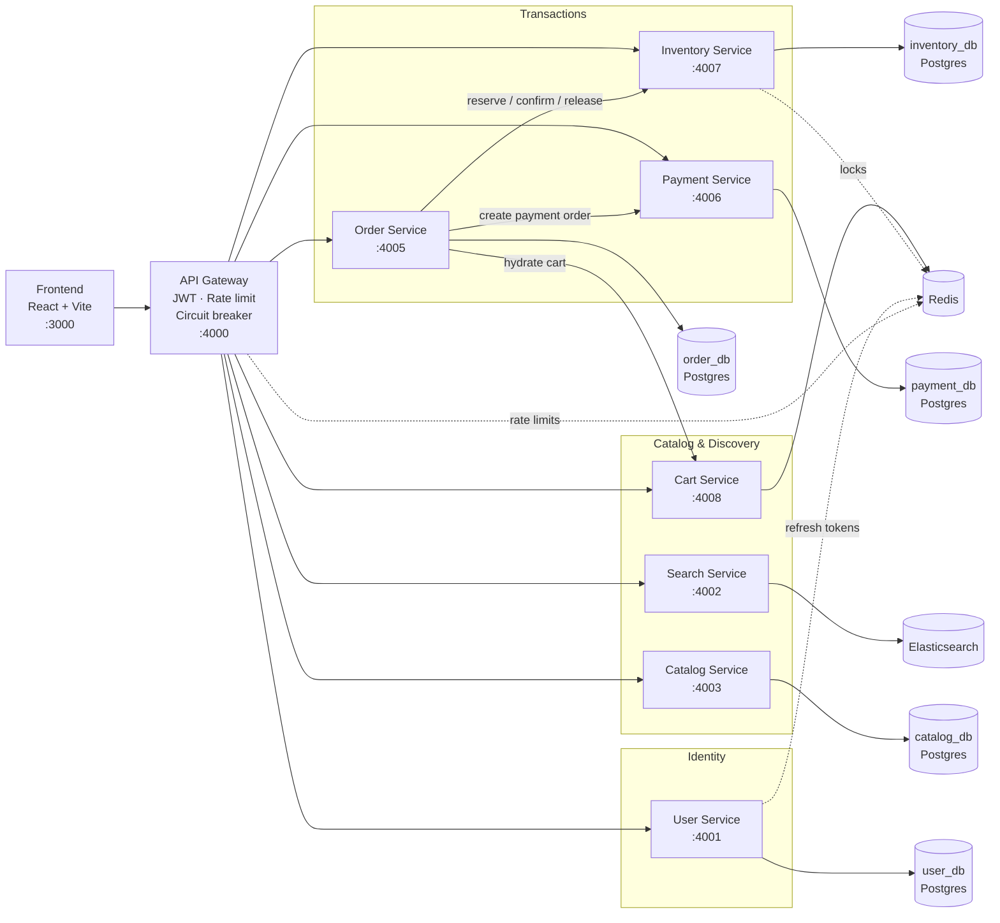
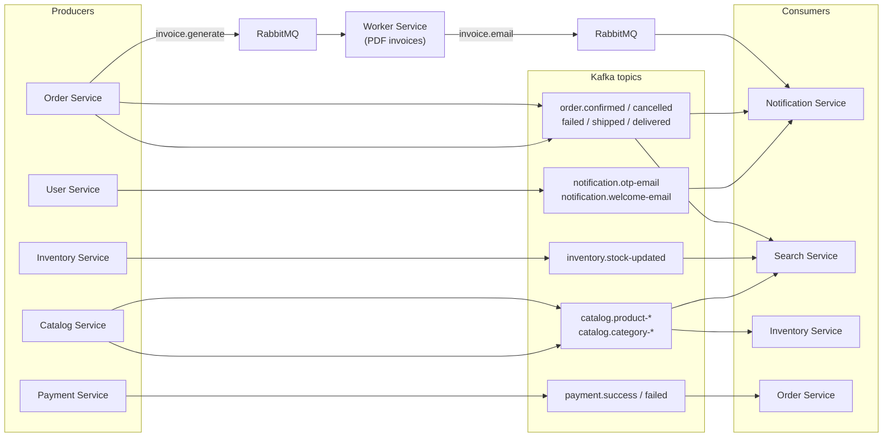
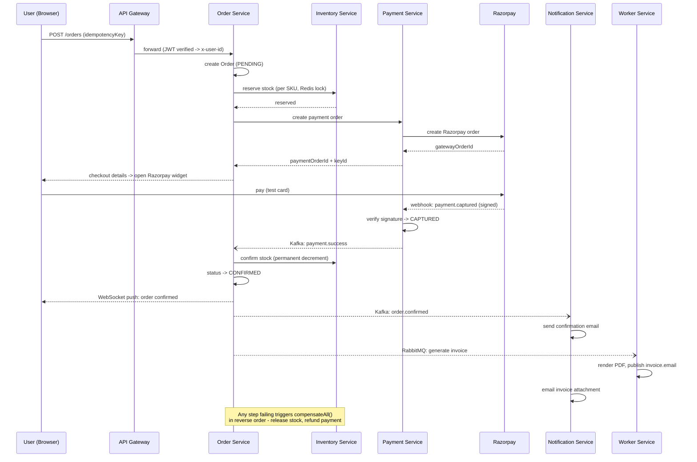

<div align="center">

# ShopEase — Distributed E-Commerce Platform

**A production-grade, event-driven microservices platform for online retail**

Built with saga orchestration, distributed locking, idempotent writes, circuit breakers,
and dual-broker messaging (Kafka + RabbitMQ) — the same patterns used in high-throughput
transactional systems applied to a shopping-cart-and-checkout domain.

[](https://nodejs.org)
[](https://expressjs.com)
[](https://react.dev)
[](https://www.postgresql.org)
[](https://redis.io)
[](https://kafka.apache.org)
[](https://www.rabbitmq.com)
[](https://www.elastic.co)
[](https://www.docker.com)
[](https://www.prisma.io)


[Architecture](#architecture) · [Features](#features) · [Tech Stack](#tech-stack) · [Getting Started](#getting-started) · [API](#api-overview) · [Design Patterns](#design-patterns--resilience) · [Observability](#observability)

</div>

---

## Overview

ShopEase is a full e-commerce backend + frontend built as **10 independently deployable services**
(9 Node.js microservices + a React SPA) communicating over HTTP, Kafka, and RabbitMQ. Every
integration is real, not mocked: Google Sign-In, SendGrid transactional email, Razorpay payments
with signature-verified webhooks, Elasticsearch-backed search, and Redis-based distributed locking.


---

## Architecture

The system is split into three views so each stays readable: the **request path** (synchronous,
gateway to services to databases), the **event backbone** (asynchronous, Kafka + RabbitMQ), and
the **checkout saga** (the one flow that touches both).

### 1. Request path — client, gateway, services, data



### 2. Event backbone — Kafka domain events + RabbitMQ background jobs



Every Kafka consumer topic has a matching `dlq.<service-name>` topic — after `DLQ_MAX_RETRIES`
(3) consecutive failures a message is forwarded there instead of blocking the consumer. Every
RabbitMQ queue `X` gets a retry topology: `X` (main) → on reject → `X.retry` (TTL hold) →
dead-letters back to `X` → after `MAX_ATTEMPTS` (5) → `X.dead` (parking lot for manual replay).

### 3. Checkout saga — the flow that ties both together



**Forward path:** `RESERVE_STOCK -> CREATE_PAYMENT -> CONFIRM_STOCK -> COMPLETE`
**Compensation path** (on any failure): release/refund whatever forward steps actually completed, in reverse order.

---

## Features

| Category | What's implemented |
| --- | --- |
| **Auth** | Email + OTP (HMAC-hashed, rate-limited, timing-safe verification), Google Sign-In, JWT access + rotating refresh tokens with reuse detection |
| **Catalog & Search** | Full CRUD product/category management, Elasticsearch-backed fuzzy search + autocomplete kept in sync via Kafka |
| **Cart** | Redis-backed, per-user, survives across devices |
| **Checkout** | Orchestrated saga across inventory -> payment -> stock confirmation, with compensating transactions on failure |
| **Payments** | Real Razorpay integration (test mode), signature-verified webhooks, refunds, full audit log, idempotent payment creation |
| **Inventory** | Per-SKU Redis distributed locks (Lua scripts, deadlock-safe via sorted key acquisition), reservation-expiry sweep |
| **Notifications** | OTP / welcome / order-lifecycle emails via SendGrid, driven by Kafka and RabbitMQ consumers |
| **Invoices** | Background PDF generation (`worker-service`) via RabbitMQ, emailed as an attachment |
| **Real-time** | Live order status pushed to the browser over Socket.IO |
| **Resilience** | Per-service circuit breakers at the gateway, Kafka DLQ topics, RabbitMQ DLX retry queues, exponential backoff on inter-service calls |
| **Observability** | Every service exposes Prometheus-format `/metrics`; pre-wired Grafana + Prometheus stack |
| **Admin** | Category/product/order/inventory management, role-gated (`ADMIN`) at the gateway |

---

## Tech Stack

| Layer | Technology |
| --- | --- |
| **Frontend** | React 18, Vite, Tailwind CSS, Zustand, React Router, React Hook Form, Axios, Socket.IO client |
| **API Gateway** | Express, JWT, `ioredis`, custom circuit breaker + sliding-window rate limiter |
| **Services** | Express (per service), Prisma ORM (+ `pg` driver adapter), `kafkajs`, `amqplib` |
| **Datastores** | PostgreSQL 15 (one database per service), Redis 7 (cart, locks, refresh tokens, rate limits) |
| **Messaging** | Apache Kafka (domain events), RabbitMQ (background jobs, DLX retry topology) |
| **Search** | Elasticsearch 8 + Kibana |
| **Payments** | Razorpay (order creation, HMAC-signed webhooks, refunds) |
| **Email** | SendGrid |
| **PDF** | PDFKit |
| **Observability** | Prometheus (`prom-client` per service) + Grafana |
| **Infra** | Docker Compose (infra only — services run via `npm run dev`) |

---

## Repository Layout

```
EcommerceEngine/
├── server/
│   ├── api-gateway/         Routing · JWT auth · rate limiting · circuit breaker
│   ├── user-service/        Auth (OTP + Google), JWT issuance, refresh rotation
│   ├── catalog-service/     Products & categories — source of truth
│   ├── inventory-service/   Stock, reservations, Redis distributed locks
│   ├── search-service/      Elasticsearch indexing + query
│   ├── cart-service/        Redis-backed shopping cart
│   ├── order-service/       Checkout saga orchestrator + WebSocket order status
│   ├── payment-service/     Razorpay integration + signed webhooks + refunds
│   ├── notification-service/Transactional email (Kafka + RabbitMQ consumer)
│   └── worker-service/      Background PDF invoice generation (RabbitMQ)
├── shared/
│   ├── constants/kafka-topics.js   Single source of truth for topic names
│   ├── rabbitmq/rabbitmq.js        Connection + DLX retry-topology helper
│   ├── middlewares/                 Shared error handler + Prometheus metrics
│   └── utils/dlqHandler.js          Kafka consumer DLQ wrapper
├── frontend/                 React + Vite + Tailwind + Zustand
├── docker/prometheus.yml     Scrape config for all services
├── docker-compose.yml        Infrastructure: Postgres, Redis, Kafka, RabbitMQ, ES, Prometheus, Grafana
└── LOCAL_SETUP.md            Full setup guide incl. third-party credentials
```

Each service is self-contained — its own `package.json`, `.env.example`, and (where it owns
data) `prisma/schema.prisma` — and can be run, tested, and deployed independently.

---

## Data Model (per service)

Each service owns its database exclusively — no service reaches into another's tables directly;
all cross-service reads go through HTTP or events.

| Service | Models |
| --- | --- |
| `user-service` | `User`, `AuthProvider` |
| `catalog-service` | `Category`, `Product` |
| `inventory-service` | `Stock`, `StockReservation`, `IdempotencyRecord` |
| `order-service` | `Order`, `OrderItem`, `SagaLog`, `IdempotencyRecord` |
| `payment-service` | `PaymentOrder`, `Refund`, `PaymentAuditLog`, `IdempotencyRecord` |

`SagaLog` and `PaymentAuditLog` exist specifically so failures are diagnosable after the fact —
every saga step and every webhook/verification attempt is recorded before and after execution.

---

## Design Patterns & Resilience

| Pattern | Where | Why |
| --- | --- | --- |
| **Saga (orchestration)** | `order-service/src/services/saga.service.js` | Coordinates a multi-service transaction (stock -> payment -> stock confirm) without 2PC, with explicit compensation on failure |
| **Distributed locking** | `inventory-service/src/utils/distributedLock.js` | Redis + Lua scripts, all-or-nothing multi-key acquisition, sorted keys to avoid cross-checkout deadlocks, fails closed on Redis errors |
| **Circuit breaker** | `api-gateway/src/services/proxy.js` | Per-downstream-service breaker (CLOSED -> OPEN -> HALF_OPEN) so one failing service can't cascade into gateway-wide outages |
| **Idempotency keys** | Order creation, payment order creation, refunds, Kafka consumers | Safe retries on network blips without double-charging or double-reserving stock |
| **Rate limiting** | `api-gateway/src/middlewares/rateLimiting.middleware.js` | Redis sliding-window, combined IP + user + per-endpoint limits (e.g. 5 checkout attempts/min) |
| **Dead-letter queues** | Kafka (`shared/utils/dlqHandler.js`) and RabbitMQ (`shared/rabbitmq/rabbitmq.js`) | Poison messages are quarantined instead of blocking a partition/queue forever |
| **Signed webhooks** | `payment-service` | Razorpay webhook signature verified before any state change; raw body preserved via `express.raw()` ahead of the JSON parser |
| **Refresh-token rotation** | `user-service/src/services/auth.service.js` | Each refresh issues a new `jti`; reuse of an old one is treated as a stolen-token signal and force-invalidates the session |
| **Database-per-service** | Every stateful service | No shared schema — services are independently deployable and scalable |

---

## Getting Started

### Prerequisites
- Node.js 18+, npm 9+
- Docker Desktop (or Docker Engine + Compose v2)
- Free accounts: [Google Cloud Console](https://console.cloud.google.com/apis/credentials) (OAuth), [SendGrid](https://signup.sendgrid.com), [Razorpay](https://dashboard.razorpay.com/signup) 

### 1. Start infrastructure
```bash
docker compose up -d
docker compose ps
```

### 2. Configure environment
```bash
for service in api-gateway user-service search-service catalog-service \
               notification-service order-service payment-service \
               inventory-service cart-service worker-service; do
  cp "server/$service/.env.example" "server/$service/.env"
done
```

### 3. Run migrations
```bash
for service in user-service catalog-service inventory-service order-service payment-service; do
  (cd "server/$service" && npx prisma migrate deploy)
done
```

### 4. Start services
```bash
# From each service directory:
npm install && npm run dev

# Or run all in parallel with your preferred process manager (pm2, concurrently, turbo, etc.)
```

### 5. Start the frontend
```bash
cd frontend
npm install
npm run dev   # http://localhost:3000
```

> Razorpay webhooks can't reach `localhost` — tunnel the gateway with [ngrok](https://ngrok.com)
> and register `https://<tunnel>/api/payments/webhooks/razorpay` in the Razorpay dashboard.

---

## API Overview

All traffic goes through the gateway at `http://localhost:4000/api`.

| Method | Route | Auth | Description |
| --- | --- | --- | --- |
| `POST` | `/users/auth/send-otp` | Public | Request signup OTP |
| `POST` | `/users/auth/verify-otp` | Public | Verify OTP, create account |
| `POST` | `/users/auth/login` | Public | Email + password login |
| `POST` | `/users/auth/google-auth` | Public | Google Sign-In |
| `POST` | `/users/auth/refresh` | Cookie | Rotate access/refresh tokens |
| `GET` | `/catalog/products` | Public | List / filter products |
| `POST` | `/catalog/products` | Admin | Create product |
| `GET` | `/search/products?q=` | Public | Fuzzy search |
| `GET` \| `POST` | `/cart` / `/cart/items` | User | View / modify cart |
| `POST` | `/orders` | User | Checkout — starts the saga |
| `GET` | `/orders/:orderId` | User (owner) / Admin | Order detail |
| `POST` | `/orders/:orderId/verify-payment` | User (owner) | Client-side payment verification |
| `POST` | `/orders/:orderId/cancel` | User (owner) | Cancel + trigger compensation |
| `POST` | `/orders/:orderId/ship` | Admin | Mark shipped |
| `POST` | `/payments/webhooks/razorpay` | Signed | Razorpay event webhook |


---

## Observability

Every service exposes:
- `GET /health` — liveness + downstream dependency (DB) check
- `GET /metrics` — Prometheus format: request-duration histograms, default Node.js process metrics

`docker/prometheus.yml` scrapes all services; point Grafana at `http://prometheus:9090` as a
data source and build dashboards from `http_request_duration_seconds` / `http_requests_total`.

---

## Scaling & Failure Handling

- **Stateless services** — no in-memory session state; horizontal scaling is just running more
  instances behind the gateway. Kafka consumer groups and RabbitMQ competing consumers
  load-balance automatically across instances.
- **Exponential backoff** on inter-service HTTP calls, Kafka producer retries, RabbitMQ DLX
  retries, and SendGrid retries.
- **Fail-closed locking** — if Redis is unreachable during stock reservation, the request is
  rejected rather than risking an oversold SKU.
- **Reservation-expiry sweep** — a background interval releases stock reservations that were
  never confirmed (abandoned checkouts), independent of the saga's own compensation path.

---
